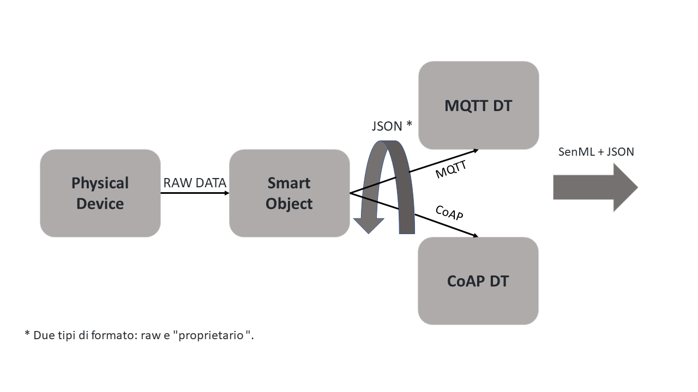

# IoT-DT-Project

## L’obbiettivo

L’obbiettivo del progetto è la creazione di uno “dummy” smart object IoT che esegue l'inoltro di dati grezzi ad una controparte logica (digital twin) che provvederà alla formattazione dei dati in formati standard e alla loro esposizione verso il mondo esterno tramite protocolli di trasmissione standard.

  

## Dati
I dati utilizzati provengono dal data set [“Condition monitoring of hydraulic systms Data Set”](https://archive.ics.uci.edu/ml/datasets/Condition+monitoring+of+hydraulic+systems#).

I dati presenti riguardano la valutazione delle condizioni di un banco di prova idraulico sulla base di dati multi-sensore.
(I dati saranno usati in una seconda parte del progetto per rendere “intelligente” il/i DT interconnessi allo smart object.)

Per ulteriori informazioni sulla descrizione dei dati si consiglia di leggere il file “description.txt” presente direttamente nella cartella del data set.

## Protocolli
I protocolli che sono implementati e (saranno implementati) tra smart object e DT e successivamente da DT al mondo esterno sono:
* CoAP: protocollo REST progettato dal IETF Constrained RESTful Environments (CoRE) Working Group – [RFC 7252](https://tools.ietf.org/html/rfc7252).
  * La libreria usata è [Eclipse Californium](https://www.eclipse.org/californium/).
* MQTT: protocollo Pub/Sub progettato dal [Organization for the Advancement of Structured Information Standards (OASIS)](https://www.oasis-open.org/).
  * La libreria usata è [Eclipse Paho](https://www.eclipse.org/paho/).
  
## Formato dati e formattazione
La formattazione dati che verrà usata per esporre i valori dei sensori all’esterno tramite il/i DT è [SenML](https://tools.ietf.org/html/rfc8428), mentre [JSON](https://www.json.org/json-en.html) verrà utilizzato come formato per lo scambio di dati. Alcune unità di misura non vengono supportate da SenML (per esempio i bar), si consiglia di seguire la tabella delle unità di misura fornite nel RFC 8428.
